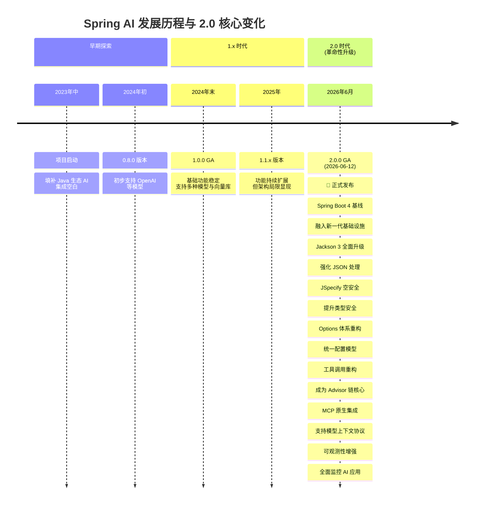

## Spring AI 2.0 介绍

### 🌟 一、Spring AI 2.0 概览与核心价值

Spring AI 2.0 于 **2026年6月12日正式发布 GA 版本**（2.0.0）。它并非简单的功能堆砌，而是对底层基础、开发模型和工程能力进行了**彻底的重构与现代化升级**，旨在让 Java 开发者能以**熟悉的 Spring 范式**，构建**可工程化、可组合、可治理**的 AI 应用。

其核心价值在于：
*   **统一抽象与可移植性**：提供统一的 API（如 `ChatClient`），屏蔽不同模型提供商（OpenAI、Anthropic、Google Gemini、Ollama 等）的 API 差异，实现**模型切换零代码变更**。
*   **工程化与生产就绪**：内置重试、速率限制、监控、安全防护等企业级特性，将 AI 能力纳入 Spring Boot 的应用生命周期和治理体系。
*   **AI 能力增强**：原生支持**工具调用（Function Calling）**、**检索增强生成（RAG）**、**结构化输出**、**多模态交互**等高级 AI 模式，并简化了实现。
*   **开发体验提升**：采用 Builder 模式、流式 API、注解驱动等，简化代码，提升开发效率，并与 Kotlin 等语言有更好的互操作性。

### 📊 二、Spring AI 发展历程与 2.0 核心变化

了解其演进，能更好地理解 2.0 的革命性。



#### 🔧 核心架构升级详解

1.  **Spring Boot 4 & Spring Framework 7 新基线**
    Spring AI 2.0 要求 **Spring Boot 4.x** 和 **Spring Framework 7.x**。这不仅是版本升级，更是为了：
    *   **利用新基础设施**：享受 Spring Boot 4 更现代的依赖体系、更清晰的配置模型、更强的可观测性支持（如内置 gRPC 支持、HTTP 客户端 SSRF 防护）。
    *   **面向未来**：为后续特性（如虚拟线程、AOT 编译）铺平道路，确保框架的可持续发展。
2.  **Jackson 3 全面升级**
    从 Jackson 2 升级到 Jackson 3，对 AI 应用至关重要。
    *   **改进点**：增强了 JSON 序列化和反序列化的能力，提供了更好的默认行为和更灵活的自定义选项（如 `JsonHelper` 工具类）。
    *   **为何重要**：AI 应用中大量涉及模型输出解析、工具参数序列化、RAG 元数据管理等，Jackson 3 提供了更稳定、更高效的 JSON 处理基础。
3.  **JSpecify 空安全注解全面引入**
    整个代码库使用 `@Nullable`、`@NonNull` 等 JSpecify 注解进行标注。
    *   **好处**：在**编译期**就能捕捉潜在的空指针异常（NPE），大幅提升代码健壮性，减少运行时错误。这对 Kotlin 开发者尤其友好，能提供更符合 Kotlin 习惯的 API 体验。
4.  **Options 体系重构**
    对模型配置选项（Options）进行了大规模、系统化的重构。
    *   **核心原则**：
        *   **Builder 模式**：所有 Options 必须通过 Builder 创建，创建后**不可变**。
        *   **默认值统一**：默认值在 Options 层统一定义，而非散落在配置文件或模型实现中。
        *   **可合并性**：Builder 支持无反射的配置合并。
        *   **解耦**：配置项（如 `spring.ai.openai.chat.options.temperature`）与模型 Option 对象解耦，移除了冗余的 `.options` 前缀。
    *   **开发者收益**：配置更清晰、更一致、更类型安全，模型切换时配置管理更轻松。
5.  **工具调用（Tool Calling）重构**
    这是 2.0 最重大的架构变化之一，工具调用从模型内部实现中剥离，成为了**Advisor 链**的核心部分。
    *   **1.x 方式**：工具执行循环被锁死在每个 `ChatModel` 内部，难以自定义和扩展。
    *   **2.0 新方式**：工具调用通过 **`ChatClient`** 与 **`ToolCallingAdvisor`**（推荐）协同工作。工具定义更简洁（推荐 `@Tool` 注解），执行循环由 Advisor 管理，模型、工具、顾问逻辑完全解耦，**高度可组合和可观测**。

```java
// 2.0 中推荐使用 @Tool 注解定义工具
@Component
public class DateTimeTools {
    @Tool(description = "获取用户当前时区的日期和时间")
    public String getCurrentTime() {
        // ... 获取并格式化时间
        return formattedTime;
    }
}
```

```java
// ChatClient 中通过 .tools() 方法注入工具
String response = chatClient.prompt()
    .user("现在几点了？")
    .tools(dateTimeTools) // 注入工具Bean
    .call()
    .content();
```

### ⚙️ 三、Spring AI 2.0 核心功能详解与代码示例

下面通过表格和代码带你了解 2.0 的核心能力。

#### 🧩 核心功能概览

| 功能领域 | 核心能力 | 关键 API/组件 | 业务价值 |
| :--- | :--- | :--- | :--- |
| **🤖 模型集成** | 多模型支持（OpenAI, Anthropic, Gemini, Ollama等）、统一API、模型路由 | `ChatModel`, `ChatClient`, `ChatOptions` | **屏蔽差异**：一套代码，轻松切换和比较不同模型。 |
| **🛠️ 工具调用** | 函数调用、Agent能力、业务系统操作 | `@Tool`注解, `ToolCallingAdvisor`, `ChatClient.tools()` | **连接现实**：让AI能调用你的业务代码、API、数据库，执行操作。 |
| **📚 检索增强(RAG)** | 知识库问答、文档理解、上下文增强 | `VectorStore`, `DocumentReader`, `EmbeddingModel`, `ChatMemory` | **知识注入**：基于企业私有数据回答，减少幻觉，提升准确性。 |
| **📊 结构化输出** | JSON响应、POJO映射、数据抽取 | `ChatClient.call().entity()`, `@JsonFormat` | **可靠解析**：将模型输出直接转为Java对象，便于后续处理和集成。 |
| **🎨 多模态支持** | 图文理解、语音交互、文生图 | `UserMessage` with media, `Media` object | **富媒体交互**：处理图片、音频、视频，构建更丰富的AI应用。 |
| **🔍 可观测性** | 指标监控、链路追踪、Token消耗统计 | Micrometer, OpenTelemetry, `ObservationRegistry` | **生产保障**：洞察AI应用运行状态，优化成本，排查问题。 |
| **🔌 MCP集成** | 模型上下文协议、工具/资源标准化 | `@McpTool`, `@McpResource`, MCP Client/Server | **生态互联**：让Spring应用能发现、调用外部MCP工具，或暴露自身能力。 |

#### 💻 核心功能代码示例

> **注意**：以下示例基于 Spring AI 2.0.0，依赖管理使用 `spring-ai-bom`。请确保你的项目使用 **Spring Boot 4.x** 和 **Java 21+**。

**1. 基本对话（Chat）**

```java
@Service
public class ChatService {
    private final ChatClient chatClient;
    public ChatService(ChatClient.Builder chatClientBuilder) {
        this.chatClient = chatClientBuilder.build();
    }
    public String chat(String message) {
        return chatClient.prompt()
            .user(message)
            .call()
            .content();
    }
}
```

**2. 工具调用（Function Calling）**

这是构建 Agent 的核心，让 AI 能够调用外部功能。

```java
// 1. 定义工具
@Component
public class WeatherTools {
    @Tool(description = "获取指定城市的当前天气")
    public String getCurrentWeather(String city) {
        // 模拟调用天气API
        return city + " 当前天气晴朗，气温25°C";
    }
}
// 2. 在ChatClient中使用工具
@Service
public class AgenticChatService {
    private final ChatClient chatClient;
    public AgenticChatService(ChatClient.Builder chatClientBuilder, WeatherTools weatherTools) {
        this.chatClient = chatClientBuilder
            .defaultTools(weatherTools) // 可以注册默认工具
            .build();
    }
    public String askWithTools(String question) {
        return chatClient.prompt()
            .user(question)
            .call() // ToolCallingAdvisor 会自动处理工具调用循环
            .content();
    }
}
```

**3. 检索增强生成（RAG）**

结合企业知识库回答问题。

```java
// 1. 准备向量存储和嵌入模型
@Bean
public VectorStore vectorStore(EmbeddingModel embeddingModel) {
    return SimpleVectorStore.builder(embeddingModel).build();
}
// 2. 加载文档并添加到向量库
@Service
public class RagService {
    private final ChatClient chatClient;
    private final VectorStore vectorStore;
    // 假设文档已加载到 vectorStore
    public String askWithRag(String question) {
        // 1. 检索相关文档
        List<Document> relevantDocs = vectorStore.similaritySearch(
            SearchRequest.query(question).withTopK(3));
        // 2. 将检索到的文档作为上下文
        String context = relevantDocs.stream()
            .map(Document::getContent)
            .collect(Collectors.joining("\n\n"));
        // 3. 带上下文提问
        return chatClient.prompt()
            .user(question)
            .system("请仅根据以下上下文信息回答问题：\n" + context)
            .call()
            .content();
    }
}
```

**4. 结构化输出**

将模型响应直接映射为 Java 对象。

```java
// 定义期望的输出结构
public record WeatherInfo(String city, double temperature, String condition) {}
@Service
public class StructuredOutputService {
    private final ChatClient chatClient;
    public String getStructuredWeather(String city) {
        WeatherInfo weather = chatClient.prompt()
            .user("获取" + city + "的天气信息")
            .call()
            .entity(WeatherInfo.class); // 直接获取强类型对象
        return weather.toString();
    }
}
```

**5. 多模态支持**

处理包含图片的输入。

```java
@Service
public class MultimodalService {
    private final ChatClient chatClient;
    public String describeImage(byte[] imageData, String mimeType) {
        Media media = new Media(mimeType, imageData);
        return chatClient.prompt()
            .user(new UserMessage("请描述这张图片", List.of(media)))
            .call()
            .content();
    }
}
```

### 🚀 四、高级特性与最佳实践

**1. Advisor 链**

Advisor 是 Spring AI 2.0 中**处理生成式 AI 模式的核心拦截器机制**，你可以像配置 Spring Security 一样，将各种行为（如 RAG、记忆、安全、日志）组合成链式处理流程。

```java
@Service
public class AdvancedChatService {
    private final ChatClient chatClient;
    public AdvancedChatService(
            ChatClient.Builder chatClientBuilder,
            VectorStore vectorStore,
            ChatMemory chatMemory) {
        this.chatClient = chatClientBuilder
            .defaultAdvisors(
                new QuestionAnswerAdvisor(vectorStore), // RAG Advisor
                new PromptChatMemoryAdvisor(chatMemory) // 记忆 Advisor
            )
            .build();
    }
    // ... 调用方法
}
```

**2. MCP (Model Context Protocol) 集成**

MCP 是连接 AI 模型与数据/工具的开放标准。Spring AI 2.0 **原生支持 MCP 2.0**，可以轻松将 Spring Bean 暴露为 MCP 工具/资源，或发现并调用外部 MCP 服务器。

```java
// 将Java方法暴露为MCP工具
@Component
public class McpToolExample {
    @McpTool(description = "执行用户订单退款")
    public String refundOrder(String orderId, double amount) {
        // 业务逻辑
        return "订单 " + orderId + " 退款 " + amount + " 元成功";
    }
}
```

**3. 可观测性**

通过 Micrometer 和 OpenTelemetry，自动收集 AI 调用的指标（如 Token 消耗、延迟）和追踪信息，集成到你的监控系统（如 Prometheus + Grafana）中。

```yaml
# application.yml 中开启观察
management:
  metrics:
    export:
      prometheus:
        enabled: true
  observation:
    enabled: true
```

#### 📋 最佳实践建议

| 方面 | 建议 | 原因 |
| :--- | :--- | :--- |
| **依赖管理** | 使用 `spring-ai-bom` 统一版本 | 避免版本冲突，确保兼容性 |
| **模型选择** | 根据场景选择：简单文本用GPT-5-mini，复杂推理用Gemini，工具调用用Claude | **成本与性能最优** |
| **提示词工程** | 使用 `PromptTemplate` 管理提示词，明确角色、上下文、任务和输出格式 | **稳定输出，减少幻觉** |
| **安全防护** | **永远不要**直接将用户输入传给系统提示词。使用Advisor进行输入/输出过滤。 | 防止**提示注入攻击**和敏感信息泄露 |
| **错误处理** | 实现重试、降级策略，处理模型限流、超时等异常。 | **提升系统韧性** |
| **成本控制** | 监控Token消耗，设置合理的MaxTokens，考虑使用缓存。 | **避免意外高额费用** |

### ⚠️ 五、迁移与注意事项

如果你从 Spring AI 1.x 迁移，请务必关注**破坏性变更**：
*   **依赖基线**：必须升级到 Spring Boot 4.x。
*   **API 变更**：
    *   `ChatModel` 的 `call()` 方法签名变更。
    *   工具调用从 `@AiFunction` 迁移到 `@Tool`。
    *   `ChatClient.Builder` 成为构建入口。
*   **配置属性**：移除了 `.options` 前缀，配置结构更扁平化。
*   **工具调用**：必须通过 `ChatClient` 的 `.tools()` 方法显式注入工具，不再支持按名称自动解析。

> ⚠️ **重要提示**：Spring AI 2.0 是一个**重大版本更新**，迁移前请仔细阅读官方[升级指南](https://docs.spring.io/spring-ai/reference/)。

### 🔮 六、总结与展望

Spring AI 2.0 的核心在于 **“工程化”** 和 **“标准化”**。它不再只是一个调用大模型的库，而是一个**完整的、生产就绪的 AI 应用开发平台**。它让 Java 开发者能用**熟悉的 Spring 生态体系**，将 AI 能力**无缝、安全、可控地**融入企业应用，真正成为业务系统的一部分，而不仅仅是外挂的聊天窗口。

未来，Spring AI 将继续在**多模态交互**、**Agent 编排**、**模型评估与优化**以及与**Spring Cloud 生态**（如服务发现、配置中心、分布式事务）的深度融合上发力。

### 📚 七、学习资源与官方文档

*   **官方文档**：[Spring AI Reference Documentation](https://docs.spring.io/spring-ai/reference/) - **最权威、最全面**的参考资料，包含所有 API 说明和指南。
*   **官方博客**：[Spring AI 2.0.0 GA Available Now](https://spring.io/blog/2026/06/12/spring-ai-2-0-0-ga-available-now/) - 了解发布背景和核心变革。
*   **GitHub仓库**：[spring-projects/spring-ai](https://github.com/spring-projects/spring-ai) - 查看源码、提交 Issue、贡献代码。
*   **示例代码**：[spring-ai-examples](https://github.com/spring-projects/spring-ai-examples) - 官方维护的示例项目，是学习的最佳起点。
*   **中文社区**：CSDN、掘金等平台上有不少开发者分享的实战文章和视频教程，可以搜索“Spring AI 2.0”找到。

希望这份详细介绍能帮助你全面理解 Spring AI 2.0 并开始构建你的 AI 应用！如果你在具体实践中遇到问题，最好的办法永远是查阅官方文档或搜索社区资源。


