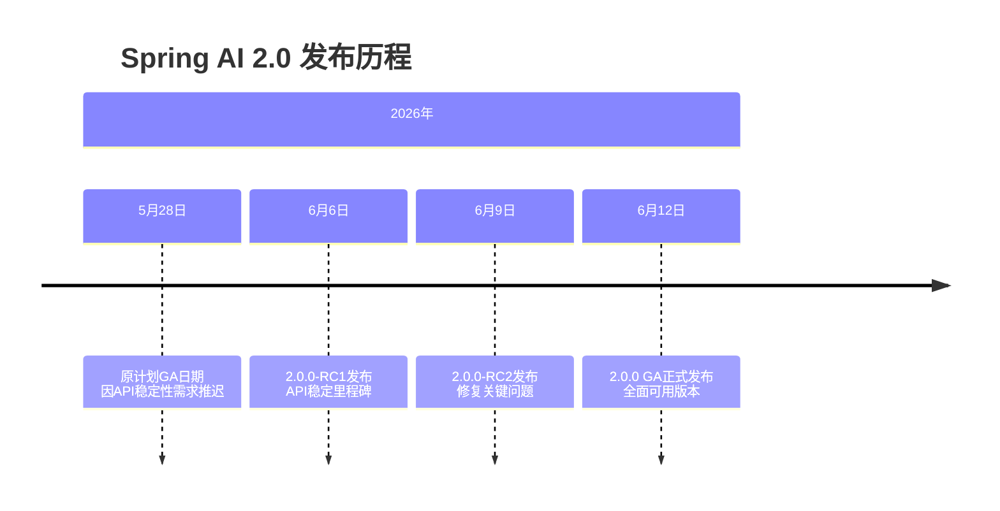
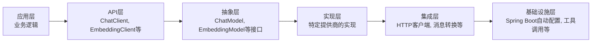
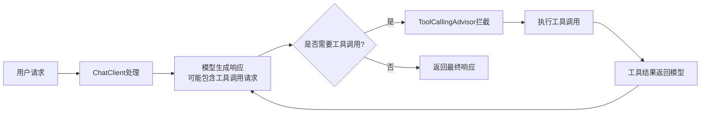

# Spring AI 2.0 深度分析报告：架构、特性与实战指南（2026年7月）

## 1 Spring AI 2.0 概述与背景

Spring AI 2.0 于 **2026年6月12日** 正式发布（GA版本），是 Spring 生态系统在 AI 工程领域的重要里程碑。这个版本代表了项目自早期快速发展后的**全面成熟化重构**，旨在建立更稳固的基础、提升开发者体验，并为未来可持续发展奠定基础。

### 1.1 项目定位与核心目标

Spring AI 是一个**面向 AI 工程的应用框架**，其核心目标是解决 AI 集成中的根本挑战：将企业的**数据与 API** 与 **AI 模型**连接起来。项目借鉴了 Python 生态中 LangChain 和 LlamaIndex 等知名项目的设计理念，但并非直接移植，而是针对 Java 生态系统和 Spring 设计原则进行了重新构思。

Spring AI 2.0 的核心目标包括：
- **提供可移植的 API 抽象**：支持所有主要 AI 提供商（Anthropic、OpenAI、Microsoft、Amazon、Google、Ollama 等），包括聊天补全、嵌入、文本转图像、音频转录、文本转语音和内容审核等模型类型
- **应用 Spring 设计原则**：将可移植性、模块化设计和 POJO 作为应用构建块的理念应用到 AI 领域
- **简化 AI 应用开发**：通过抽象和封装，使开发者能够专注于业务逻辑而非 AI 集成细节
- **支持企业级需求**：提供结构化输出、工具调用、向量数据库集成等企业级功能

### 1.2 版本兼容性与发布历程

Spring AI 2.0 的发布经历了多个里程碑版本，反映了团队对质量的高度重视：



版本兼容性是 2.0 版本的重要改进：
- **Spring AI 2.x.x**（主分支）：兼容 **Spring Boot 4.x**
- **Spring AI 1.1.x**（1.1.x 分支）：兼容 **Spring Boot 3.5.x**

这种兼容性策略确保了开发者可以根据自己的 Spring Boot 版本选择合适的 Spring AI 版本，避免了强制升级带来的兼容性问题。值得注意的是，Spring Boot 3.5 将于 2026年6月30日结束生命周期（EOL），因此升级到 Spring Boot 4.0 和 Spring AI 2.0 成为许多企业的当务之急。

## 2 架构设计与核心抽象

Spring AI 2.0 的架构设计体现了 Spring 生态系统的成熟设计原则，同时针对 AI 工程的特殊需求进行了创新性扩展。

### 2.1 设计哲学与核心原则

Spring AI 2.0 的架构设计遵循以下核心原则：
1.  **可移植性抽象**：提供统一的 API 接口，使开发者能够在不同 AI 提供商之间切换而无需修改业务代码
2.  **模块化设计**：采用高度模块化的设计，允许按需引入功能模块，减少不必要的依赖
3.  **类型安全**：广泛使用强类型数据结构和 API，提高代码可靠性和开发效率
4.  **一致性体验**：确保不同 AI 提供商和模型类型之间具有一致的开发体验
5.  **可扩展性**：提供清晰的扩展点，支持社区和企业的定制化需求

### 2.2 核心接口与抽象

Spring AI 2.0 的核心架构建立在几个关键抽象之上，这些抽象是理解整个框架的基础：

| 抽象接口 | 描述 | 关键实现 |
| :--- | :--- | :--- |
| **ChatModel** | 聊天补全模型的核心抽象，支持同步和流式交互 | OpenAiChatModel, AnthropicChatModel, OllamaChatModel |
| **EmbeddingModel** | 文本嵌入模型抽象，用于生成文本向量 | OpenAiEmbeddingModel, OllamaEmbeddingModel |
| **ImageModel** | 文本转图像模型抽象 | OpenAiImageModel, StabilityAiImageModel |
| **AudioModel** | 音频转录和文本转语音模型抽象 | OpenAiAudioModel, AzureAudioModel |
| **ModerationModel** | 内容审核模型抽象 | OpenAiModerationModel |
| **VectorStore** | 向量存储抽象，支持多种向量数据库 | PgVectorStore, RedisVectorStore, PineconeVectorStore |

### 2.3 分层架构与组件设计

Spring AI 2.0 采用了清晰的分层架构，各层职责明确，便于理解和扩展：



**关键架构改进**：
1.  **统一工具执行模型**：Spring AI 2.0 将工具执行逻辑从各个 ChatModel 实现中移除，统一通过 `ChatClient` 和 `ToolCallingAdvisor` 处理。这一改进大大简化了模型实现，并提供了更灵活的工具调用控制。
2.  **API 稳定化**：2.0 版本进行了大量 API 稳定化工作，包括空安全处理、废弃构造器改为构建器模式、每个模型类型只保留一种风格等。这些变化虽然可能需要迁移工作，但显著提升了 API 的一致性和可靠性。
3.  **配置增强**：使 Anthropic 和 OpenAI HTTP 客户端可配置，恢复了与 Spring Framework < 7.0.4 的兼容性。这为在不同 Spring 版本环境中使用 Spring AI 提供了灵活性。
4.  **自动注册机制**：始终自动注册 `ToolCallingAdvisor` 以支持运行时注入的工具。这一改进简化了工具调用配置，使开发者能够更专注于业务逻辑。

## 3 核心特性深度解析

Spring AI 2.0 引入了多项重要特性，这些特性共同构成了一个成熟、强大的 AI 应用开发框架。

### 3.1 统一工具调用

统一工具调用是 Spring AI 2.0 的**核心特性之一**，它解决了 AI 模型与外部世界交互的根本问题。该特性允许 AI 模型在需要时调用外部工具（如数据库查询、API 调用、计算等），从而扩展了模型的能力边界。

**关键改进**：
- **内置工具执行循环移除**：从每个 ChatModel（OpenAI、Ollama、Anthropic、MistralAI、DeepSeek、Bedrock Proxy、MiniMax）中移除了内置的调用/流工具执行循环和 `ToolExecutionEligibilityChecker` 接线
- **外部工具执行处理**：工具执行现在必须通过 `ChatClient` 和 `ToolCallingAdvisor`（推荐）或用户控制的 `DefaultToolCallingManager` 循环外部处理
- **配置简化**：移除了 `internalToolExecutionEnabled` 作为整合的一部分，简化了工具调用配置

**工具调用流程**：



### 3.2 结构化输出与自校正

Spring AI 2.0 提供了强大的结构化输出能力，允许将 AI 模型的输出直接映射到 POJO（Plain Old Java Objects），大大简化了结果处理。2.0 版本引入了**自校正结构化输出**特性，使模型能够自动校正输出格式，确保与预期结构匹配。

**实现机制**：
1.  **Schema 生成**：根据目标 POJO 类型生成 JSON Schema，描述期望的输出结构
2.  **提示增强**：将生成的 Schema 添加到提示中，指导模型生成符合结构的内容
3.  **输出解析**：将模型输出解析为目标 POJO 类型，处理类型转换和验证
4.  **自校正循环**：如果解析失败，自动将错误信息反馈给模型，要求其修正输出

**示例代码**：

```java
// 定义目标输出结构
public record WeatherResponse(
    String location,
    double temperature,
    String unit,
    String forecast
) {}
// 使用结构化输出
ChatClient chatClient = ChatClient.create(chatModel);
WeatherResponse response = chatClient.prompt()
    .user("What's the weather in Paris?")
    .call()
    .entity(WeatherResponse.class);
```

### 3.3 模型支持与提供商集成

Spring AI 2.0 提供了对所有主要 AI 模型提供商的广泛支持，包括：

| 提供商 | 支持的模型类型 | 关键特性 |
| :--- | :--- | :--- |
| **OpenAI** | Chat, Embedding, Image, Audio, Moderation | 流式响应, 函数调用, 视觉理解 |
| **Anthropic** | Chat | 长上下文窗口, 工具调用, 速度优化 |
| **Ollama** | Chat, Embedding | 本地模型支持, 多模态能力 |
| **Amazon Bedrock** | Chat, Embedding | AWS 集成, 多模型选择 |
| **Google Vertex** | Chat, Embedding, Image | Gemini 模型支持, 多模态 |
| **Microsoft Azure** | Chat, Embedding, Image | Azure OpenAI 服务, 企业集成 |
| **Mistral AI** | Chat | 高性能, 多语言支持 |
| **DeepSeek** | Chat | 推理能力, 成本效益 |

**统一 API 示例**：

```java
// 切换不同提供商只需更改配置
@Bean
public ChatModel chatModel() {
    // 使用 OpenAI
    return new OpenAiChatModel(openAiChatApi);
    
    // 或者使用 Anthropic
    // return new AnthropicChatModel(anthropicChatApi);
    
    // 或者使用 Ollama
    // return new OllamaChatModel(ollamaApi);
}
// 业务代码无需更改
@Autowired
private ChatModel chatModel;
public String generateResponse(String userInput) {
    ChatResponse response = chatModel.call(
        new Prompt(userInput)
    );
    return response.getResult().getOutput().getContent();
}
```

### 3.4 向量数据库与检索增强生成

Spring AI 2.0 提供了对所有主要向量数据库提供商的支持，使检索增强生成（RAG）应用开发变得简单。支持的向量数据库包括：
- **Apache Cassandra**
- **Azure AI Search**
- **Chroma**
- **Milvus**
- **Neo4j**
- **PGVector**
- **Pinecone**
- **Redis**
- **Weaviate**

**RAG 实现示例**：

```java
@Service
public class RetrievalAugmentedService {
    private final ChatClient chatClient;
    private final VectorStore vectorStore;
    public RetrievalAugmentedService(ChatClient chatClient, VectorStore vectorStore) {
        this.chatClient = chatClient;
        this.vectorStore = vectorStore;
    }
    public String answerQuestion(String question) {
        // 1. 检索相关文档
        List<Document> documents = vectorStore.similaritySearch(
            SearchRequest.query(question).withTopK(5)
        );
        
        // 2. 构建上下文
        String context = documents.stream()
            .map(Document::getContent)
            .collect(Collectors.joining("\n\n"));
        
        // 3. 生成答案
        return chatClient.prompt()
            .system("You are a helpful assistant. Use the following context to answer the question.")
            .user(String.format("Context:\n%s\n\nQuestion: %s", context, question))
            .call()
            .content();
    }
}
```

## 4 代码示例与实战应用

### 4.1 基础配置与依赖

**Maven 依赖配置**：

```xml
<dependencyManagement>
    <dependencies>
        <dependency>
            <groupId>org.springframework.ai</groupId>
            <artifactId>spring-ai-bom</artifactId>
            <version>2.0.0</version>
            <type>pom</type>
            <scope>import</scope>
        </dependency>
    </dependencies>
</dependencyManagement>
<dependencies>
    <!-- 核心依赖 -->
    <dependency>
        <groupId>org.springframework.ai</groupId>
        <artifactId>spring-ai-core</artifactId>
    </dependency>
    
    <!-- 根据需要选择模型提供商 -->
    <dependency>
        <groupId>org.springframework.ai</groupId>
        <artifactId>spring-ai-openai</artifactId>
    </dependency>
    
    <!-- 向量数据库支持（可选） -->
    <dependency>
        <groupId>org.springframework.ai</groupId>
        <artifactId>spring-ai-pgvector</artifactId>
    </dependency>
</dependencies>
```

**应用配置**：

```yaml
# application.yml
spring:
  ai:
    openai:
      api-key: ${OPENAI_API_KEY}
      chat:
        options:
          model: gpt-4o
          temperature: 0.7
      embedding:
        options:
          model: text-embedding-3-small
    vectorstore:
      pgvector:
        dimensions: 1536
        distance-type: cosine_distance
        index-type: hnsw
```

### 4.2 基础聊天应用

```java
@SpringBootApplication
public class ChatApplication {
    public static void main(String[] args) {
        SpringApplication.run(ChatApplication.class, args);
    }
    @Bean
    public CommandLineRunner chatRunner(ChatClient.Builder chatClientBuilder) {
        return args -> {
            ChatClient chatClient = chatClientBuilder.build();
            
            // 简单聊天
            String response = chatClient.prompt()
                .user("Tell me a joke about programming")
                .call()
                .content();
            
            System.out.println("Response: " + response);
            
            // 流式响应
            chatClient.prompt()
                .user("Explain quantum computing in simple terms")
                .stream()
                .content()
                .subscribe(chunk -> System.out.print(chunk));
        };
    }
}
```

### 4.3 高级功能实现

#### 4.3.1 工具调用实现

```java
@Configuration
public class ToolConfig {
    @Bean
    public ToolCallback weatherTool() {
        return FunctionToolCallback.builder("getWeather", new WeatherFunction())
            .description("Get current weather for a location")
            .inputType(WeatherRequest.class)
            .build();
    }
    
    public record WeatherRequest(String location) {}
    
    public static class WeatherFunction implements Function<WeatherRequest, String> {
        @Override
        public String apply(WeatherRequest request) {
            // 实际应用中这里会调用天气API
            return String.format("The weather in %s is 22°C and sunny", request.location());
        }
    }
}
@RestController
@RequestMapping("/api/chat")
public class ChatController {
    private final ChatClient chatClient;
    
    public ChatController(ChatClient chatClient) {
        this.chatClient = chatClient;
    }
    
    @PostMapping
    public String chat(@RequestBody String userInput) {
        return chatClient.prompt()
            .user(userInput)
            .tools("getWeather")  // 引用工具
            .call()
            .content();
    }
}
```

#### 4.3.2 结构化输出实现

```java
@Service
public class StructuredOutputService {
    private final ChatClient chatClient;
    
    public StructuredOutputService(ChatClient chatClient) {
        this.chatClient = chatClient;
    }
    
    public BookRecommendation recommendBook(String genre) {
        return chatClient.prompt()
            .system("You are a literary expert. Recommend a book based on the user's preference.")
            .user(String.format("Recommend a %s book", genre))
            .call()
            .entity(BookRecommendation.class);
    }
    
    public record BookRecommendation(
        String title,
        String author,
        int publicationYear,
        String summary,
        List<String> themes
    ) {}
}
```

#### 4.3.3 RAG 完整实现

```java
@Configuration
public class RagConfig {
    
    @Bean
    public VectorStore vectorStore(JdbcTemplate jdbcTemplate, EmbeddingModel embeddingModel) {
        return PgVectorStore.builder(jdbcTemplate, embeddingModel)
            .dimensions(1536)
            .distanceType(PgVectorStore.PgDistanceType.COSINE_DISTANCE)
            .indexType(PgVectorStore.PgIndexType.HNSW)
            .build();
    }
    
    @Bean
    public CommandLineRunner dataLoader(VectorStore vectorStore) {
        return args -> {
            // 加载文档到向量存储
            List<Document> documents = List.of(
                new Document("Spring AI 2.0 introduces unified tool calling"),
                new Document("The framework supports multiple AI providers"),
                new Document("Structured outputs enable type-safe responses")
            );
            
            vectorStore.add(documents);
        };
    }
}
@Service
public class RagService {
    
    private final ChatClient chatClient;
    private final VectorStore vectorStore;
    
    public RagService(ChatClient chatClient, VectorStore vectorStore) {
        this.chatClient = chatClient;
        this.vectorStore = vectorStore;
    }
    
    public String answerQuestion(String question) {
        // 检索相关文档
        List<Document> documents = vectorStore.similaritySearch(
            SearchRequest.query(question).withTopK(3)
        );
        
        // 构建上下文
        String context = documents.stream()
            .map(Document::getContent)
            .collect(Collectors.joining("\n\n"));
        
        // 生成答案
        return chatClient.prompt()
            .system("Answer the question based on the provided context. If the context doesn't contain the answer, say 'I don't know'.")
            .user(String.format("Context:\n%s\n\nQuestion: %s", context, question))
            .call()
            .content();
    }
}
```

### 4.4 测试与调试

Spring AI 2.0 提供了测试支持，简化了 AI 应用的测试：

```java
@SpringBootTest
class SpringAiApplicationTests {
    
    @Autowired
    private ChatClient.Builder chatClientBuilder;
    
    @Test
    void contextLoads() {
        // 基础测试
        ChatClient chatClient = chatClientBuilder.build();
        String response = chatClient.prompt().user("Hello").call().content();
        assertThat(response).isNotNull();
    }
    
    @Test
    void testStructuredOutput() {
        ChatClient chatClient = chatClientBuilder.build();
        WeatherResponse response = chatClient.prompt()
            .user("What's the weather in Tokyo?")
            .call()
            .entity(WeatherResponse.class);
            
        assertThat(response.location()).isEqualTo("Tokyo");
        assertThat(response.temperature()).isGreaterThan(-50);
    }
    
    @Test
    void testToolCall() {
        ChatClient chatClient = chatClientBuilder.build();
        String response = chatClient.prompt()
            .user("What's the weather in London?")
            .tools("getWeather")
            .call()
            .content();
            
        assertThat(response).contains("London");
    }
}
```

## 5 项目落地与最佳实践

### 5.1 项目结构与组织

推荐的项目结构如下，遵循分层架构和领域驱动设计原则：

```
src/main/java/com/example/aiapp/
├── config/                 # 配置类
│   ├── AiConfig.java       # AI 相关配置
│   └── VectorStoreConfig.java
├── controller/             # REST 控制器
├── service/                # 业务逻辑
│   ├── ChatService.java
│   └── RagService.java
├── model/                  # 数据模型
│   ├── dto/                # 数据传输对象
│   └── entity/             # 实体类
├── tool/                   # 工具定义
│   ├── WeatherTool.java
│   └── DatabaseTool.java
└── AiApplication.java      # 主应用类
src/main/resources/
├── application.yml         # 应用配置
├── prompts/                # 提示模板
│   └── system-prompt.st
└── static/                 # 静态资源
```

### 5.2 性能优化策略

**模型选择优化**：

```java
// 根据任务复杂度选择模型
@Service
public class OptimizedChatService {
    
    private final ChatModel simpleModel;  // 简单任务使用
    private final ChatModel complexModel; // 复杂任务使用
    
    public OptimizedChatService(
        @Qualifier("simpleChatModel") ChatModel simpleModel,
        @Qualifier("complexChatModel") ChatModel complexModel) {
        this.simpleModel = simpleModel;
        this.complexModel = complexModel;
    }
    
    public String generateResponse(String input, boolean isComplex) {
        ChatModel model = isComplex ? complexModel : simpleModel;
        return model.call(new Prompt(input))
            .getResult()
            .getOutput()
            .getContent();
    }
}
```

**缓存策略**：

```java
@Configuration
public class CacheConfig {
    
    @Bean
    public CacheManager cacheManager() {
        return new ConcurrentMapCacheManager("chatResponses", "embeddings");
    }
}

@Service
public class CachedChatService {
    
    private final ChatClient chatClient;
    
    @Cacheable(value = "chatResponses", key = "#userInput.hashCode()")
    public String getCachedResponse(String userInput) {
        return chatClient.prompt()
            .user(userInput)
            .call()
            .content();
    }
}
```

**批量处理**：

```java
@Service
public class BatchService {
    
    private final EmbeddingModel embeddingModel;
    
    public List<float[]> generateEmbeddings(List<String> texts) {
        // 使用批量嵌入接口提高效率
        return embeddingModel.embedForResponse(texts)
            .getResults()
            .stream()
            .map(Embedding::getOutput)
            .collect(Collectors.toList());
    }
}
```

### 5.3 测试策略

1.  **单元测试**：使用 Mock 框架测试业务逻辑
2.  **集成测试**：使用 Spring Boot Test 测试组件集成
3.  **端到端测试**：测试完整 API 流程
4.  **性能测试**：测试响应时间和吞吐量

```java
@SpringBootTest
@AutoConfigureMockMvc
class AiApplicationE2ETests {
    
    @Autowired
    private MockMvc mockMvc;
    
    @Test
    void testChatEndpoint() throws Exception {
        mockMvc.perform(post("/api/chat")
                .contentType(MediaType.APPLICATION_JSON)
                .content("{\"message\":\"Hello\"}"))
            .andExpect(status().isOk())
            .andExpect(jsonPath("$.response").exists());
    }
    
    @Test
    void testRagEndpoint() throws Exception {
        mockMvc.perform(get("/api/rag")
                .param("question", "What is Spring AI?"))
            .andExpect(status().isOk())
            .andExpect(jsonPath("$.answer").exists());
    }
}
```

### 5.4 监控与可观测性

Spring AI 2.0 与 Spring Boot 的可观测性基础设施无缝集成，提供全面的监控能力：

```java
@Configuration
public class ObservabilityConfig {
    
    @Bean
    public ObservationHandler<Observation.Context> customObservationHandler() {
        return context -> {
            if (context.getName().startsWith("spring.ai")) {
                // 记录 AI 调用指标
                Metrics.counter("ai.calls", 
                    "provider", context.getName().split("\\.")[2],
                    "status", context.getStatus().toString()
                ).increment();
            }
        };
    }
}
// 应用配置
spring:
  ai:
    chat:
      observations:
        enabled: true
        include-prompt: false  # 生产环境中可能不包含敏感信息
        include-response: false
```

## 6 未来展望与生态发展

### 6.1 项目路线图

基于 Spring AI 2.0 的发布和社区反馈，项目未来的发展方向包括：
1.  **更广泛的模型支持**：增加对更多 AI 提供商和模型类型的支持，包括多模态模型、专业领域模型等
2.  **增强的代理能力**：改进工具调用和链式调用能力，支持更复杂的 AI 代理场景
3.  **性能优化**：进一步优化性能，减少延迟，提高吞吐量
4.  **企业级功能**：增强安全性、审计、合规等企业级功能
5.  **生态系统整合**：与 Spring 生态系统中的其他项目（如 Spring Security、Spring Data、Spring Integration）更深度整合

### 6.2 生态整合

Spring AI 2.0 已经与多个 Spring 生态项目深度整合：
- **Spring Boot**：自动配置、启动器、可观测性
- **Spring Security**：安全访问控制、身份验证
- **Spring Data**：向量存储集成、数据访问抽象
- **Spring Integration**：消息传递、事件驱动架构
- **Spring Cloud**：分布式 AI 应用、微服务架构

### 6.3 社区与资源

Spring AI 2.0 拥有活跃的社区和丰富的资源：
- **官方文档**：[Spring AI Reference Documentation](https://docs.spring.io/spring-ai/reference/index.html)
- **GitHub 仓库**：[spring-projects/spring-ai](https://github.com/spring-projects/spring-ai)
- **示例项目**：[Spring AI Examples](https://github.com/spring-projects/spring-ai-examples)
- **社区资源**：[Awesome Spring AI](https://github.com/spring-projects/awesome-spring-ai)

## 7 总结

Spring AI 2.0 代表了 Java 生态系统中 AI 工程框架的重要进步。通过**统一工具调用**、**结构化输出**、**广泛的模型支持**和**企业级功能**，它为构建生产级 AI 应用提供了坚实基础。2.0 版本的**架构改进**和**API 稳定化**虽然需要一定的学习成本，但显著提升了开发体验和代码质量。

对于企业而言，现在升级到 Spring AI 2.0 和 Spring Boot 4.0 不仅是技术更新的需要，更是保持竞争力的必要举措。通过本报告的深度分析和代码示例，开发者应该能够快速上手 Spring AI 2.0，并将其应用于实际项目中，构建强大、可靠、高效的 AI 应用。

随着 AI 技术的快速发展，Spring AI 2.0 将继续演进，为 Java 开发者提供更强大、更易用的 AI 工程能力。建议开发者密切关注项目动态，积极参与社区，共同推动 Spring AI 生态的发展。

